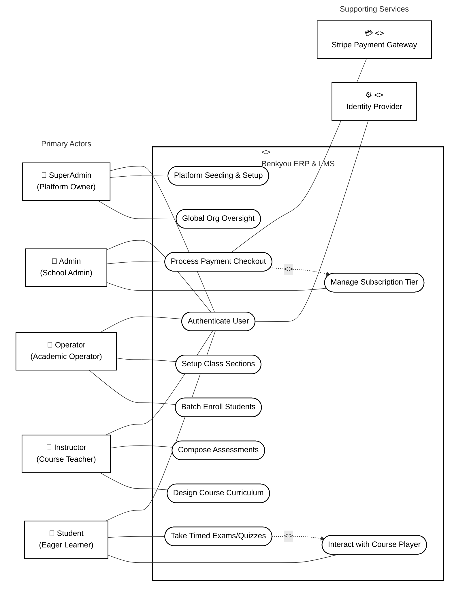

# Benkyou ERP & LMS - UML Use Case Diagram & Specification

This document presents a **Standard UML Use Case Diagram** and detailed functional specifications for the **Benkyou Web ERP & LMS Platform**, focused strictly on the **5 core user roles** (SuperAdmin, Admin, Operator, Instructor, and Student).

---

## 1. Visual Use Case Diagram

The visual diagram below follows standard UML notation:
* **Left Side**: The 5 Primary Actors (`SuperAdmin`, `Admin`, `Operator`, `Instructor`, `Student`).
* **Center Box**: The `<<Subsystem>> Benkyou ERP & LMS` system boundary containing the use cases represented as ovals.
* **Right Side**: The External System Services (`Identity Provider`, `Stripe Payment Gateway`).
* **Associations**: Straight lines connecting actors to their respective use cases, with dotted arrows representing `<<include>>` relationships.

---

## 2. UML Use Case Dictionary

### 2.1. The 5 Primary Actors

| Actor | Description | Key Systems / Controls | Associated Controller |
| :--- | :--- | :--- | :--- |
| **SuperAdmin** | The platform owner/developer. Seeds defaults, configures subscription options, and oversees multi-tenant isolation. | Global dashboard, seed scripts. | [OperatorController.cs](file:///c:/Users/Charlize%20Jane%20Inday/source/repos/Benkyou/Benkyou.API/Controllers/OperatorController.cs) |
| **Admin** | The school administrator/principal. Adjusts institutional info, branding, and coordinates plan billing. | Tenant configuration settings, billing. | [OrganizationController.cs](file:///c:/Users/Charlize%20Jane%20Inday/source/repos/Benkyou/Benkyou.API/Controllers/OrganizationController.cs) |
| **Operator** | The school registrar/operations manager. Onboards class sections and enrolls student groups in bulk. | Class sections roster, CSV Match Stage. | [ClassSectionsController.cs](file:///c:/Users/Charlize%20Jane%20Inday/source/repos/Benkyou/Benkyou.API/Controllers/ClassSectionsController.cs) |
| **Instructor** | The curriculum educator/teacher. Structures modular syllabus outlines, quizzes, exams, and grades submissions. | Lesson drag-and-drop hierarchy, quiz creator. | [AssessmentsController.cs](file:///c:/Users/Charlize%20Jane%20Inday/source/repos/Benkyou/Benkyou.API/Controllers/AssessmentsController.cs) |
| **Student** | The active learner. Attends lectures, progress milestones, flags test questions, and submits midterms. | Video player, timed exam grid, grades. | [ProgressController.cs](file:///c:/Users/Charlize%20Jane%20Inday/source/repos/Benkyou/Benkyou.API/Controllers/ProgressController.cs) |

---

### 2.2. Functional Relationships

* **`Process Payment Checkout` includes `Manage Subscription Tier`**: In order to initialize a payment transaction with the Stripe Gateway, the **Admin** must first select and set up their target plan details.
* **`Take Timed Exams/Quizzes` includes `Interact with Course Player`**: A **Student** must be in an active session inside the course player shell to run and complete an evaluation.
* **`Authenticate User` maps to `Identity Provider`**: Every primary actor requires session generation and role verification handled by the database service.
