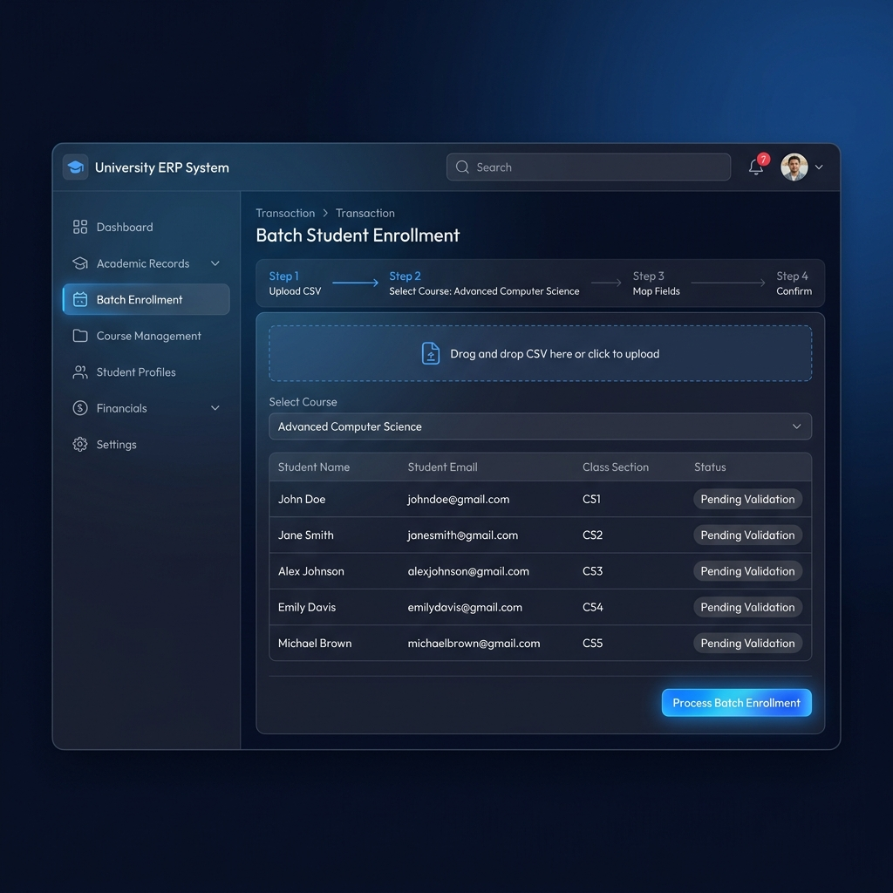
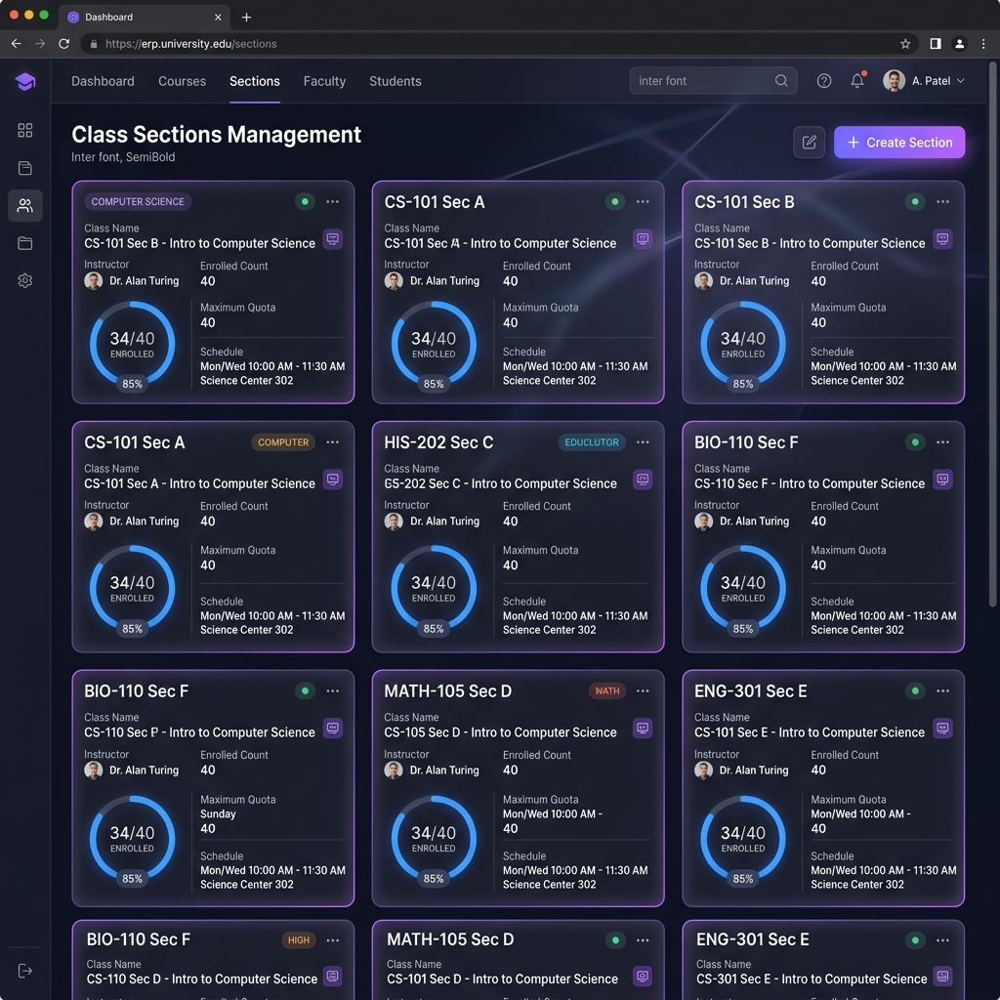
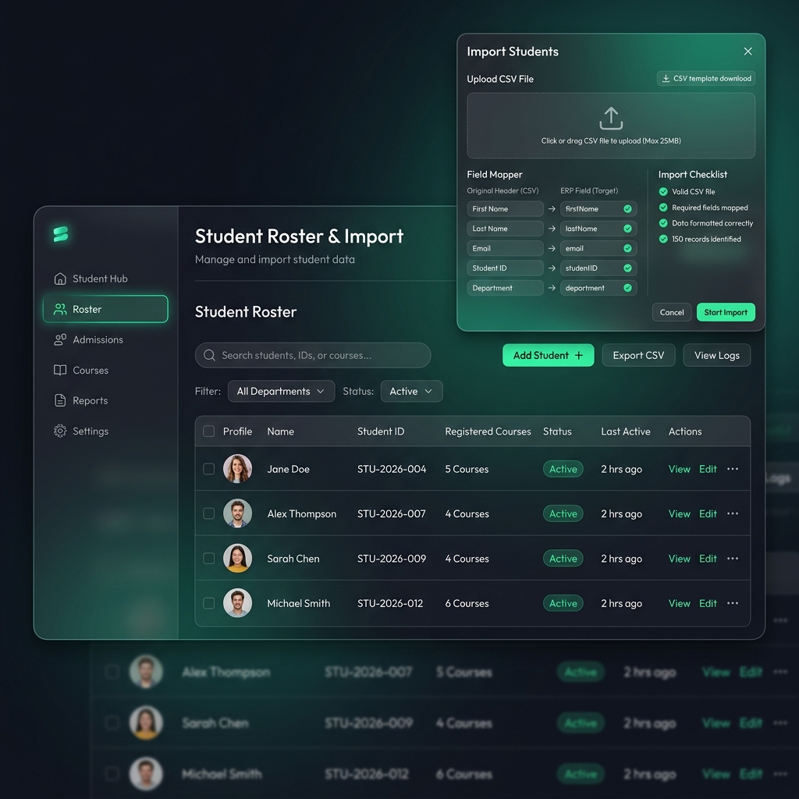
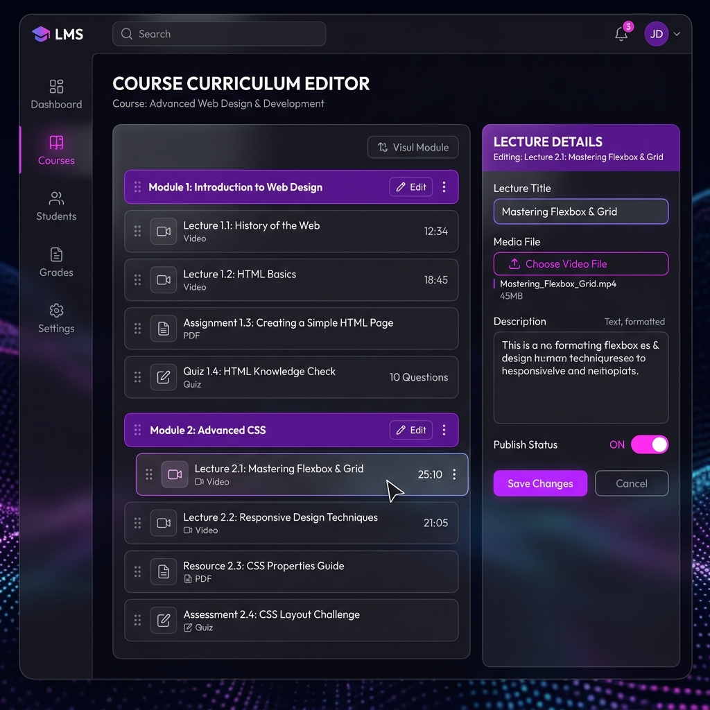
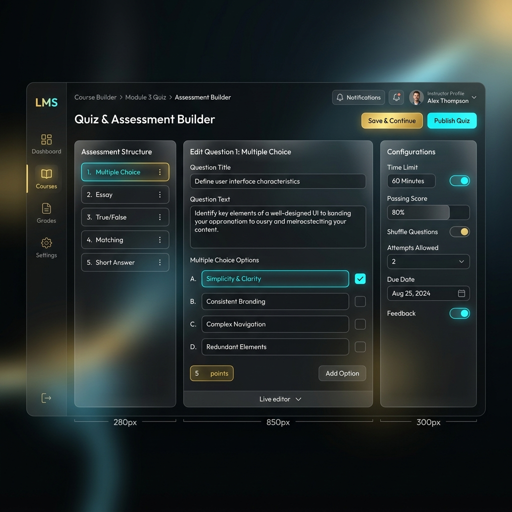
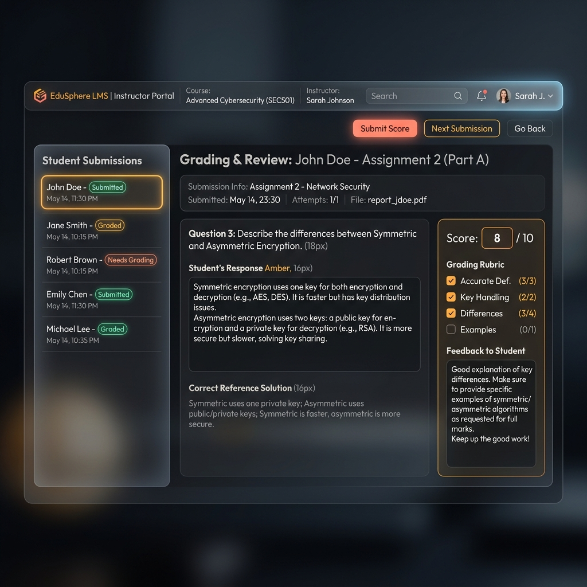
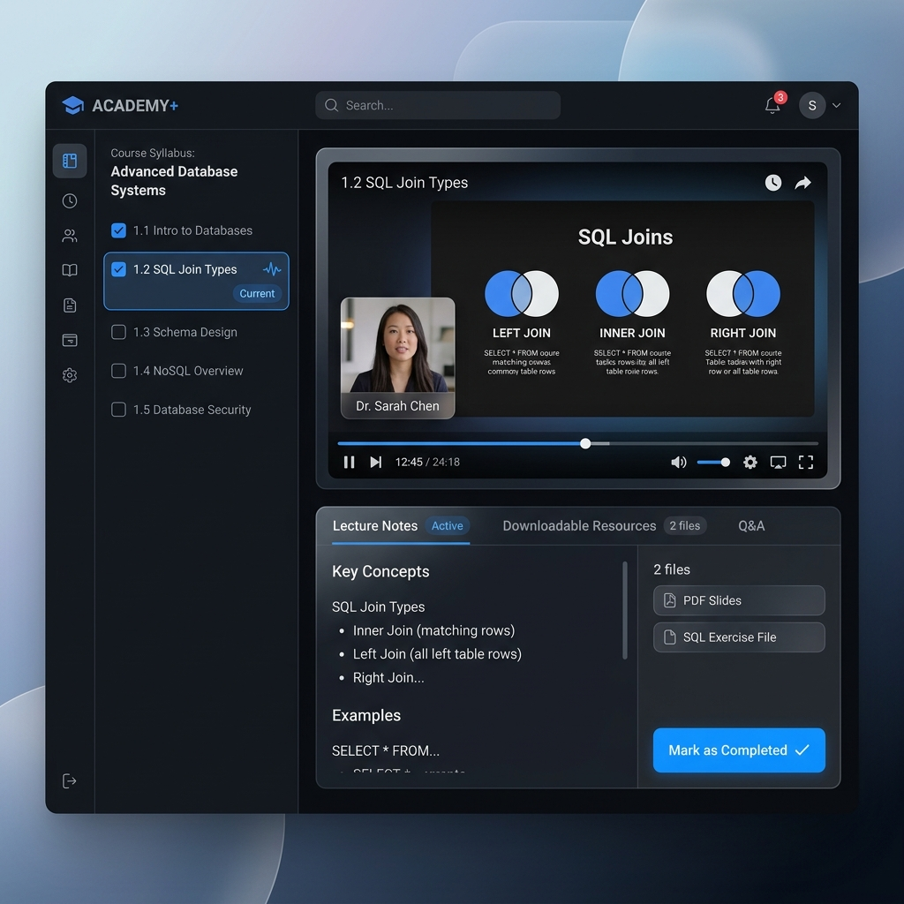
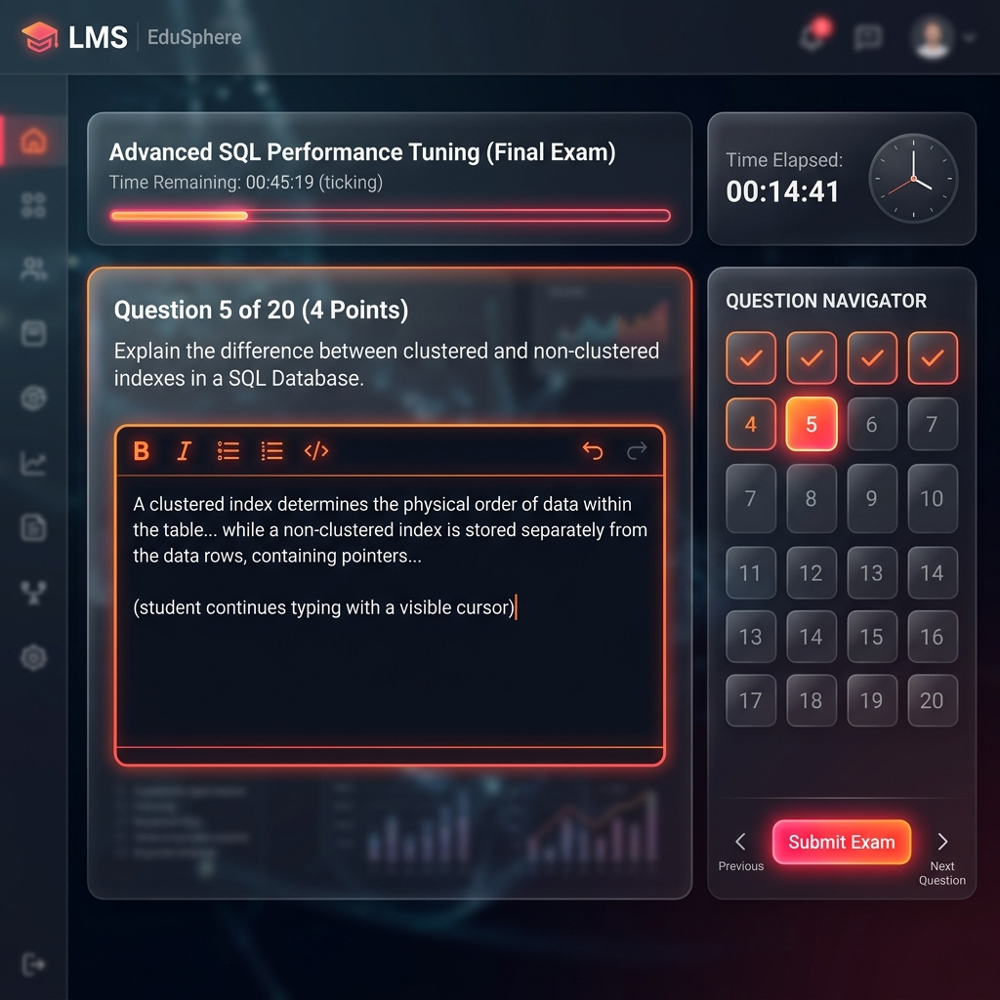
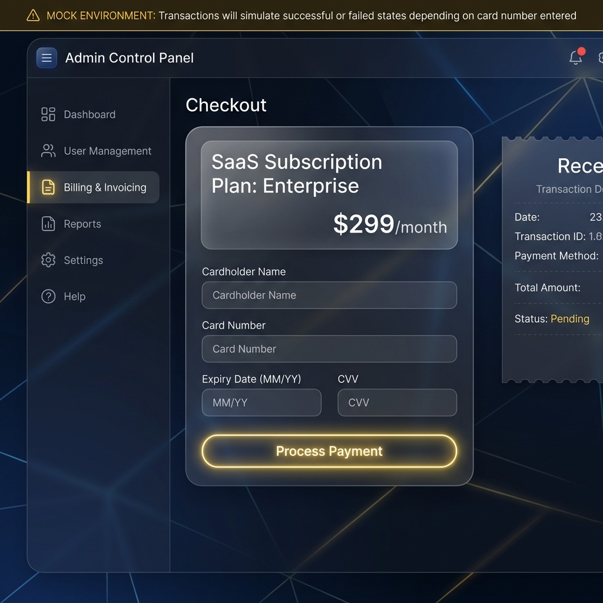

# Benkyou ERP & LMS - Screenshots, Source Code, API Functions, and Step-by-Step System Execution Guide

Welcome to the comprehensive technical documentation for the **Benkyou Web ERP & LMS Platform**. This document details the **API Functions and System Features**, accompanied by clear prototype screenshots, image label names, source code component mappings, API specifications, algorithm usage, and a detailed **step-by-step discussion on how each process works** from front-to-back.

---

## Table of Contents
1. [Academic Operations & Admissions (Operator Module)](#1-academic-operations--admissions-operator-module)
   - [API Feature 1: Batch Student Enrollment](#api-feature-1-batch-student-enrollment)
   - [API Feature 2: Class Section Setup & Management](#api-feature-2-class-section-setup--management)
   - [API Feature 3: Bulk Student Directory Onboarding](#api-feature-3-bulk-student-directory-onboarding)
2. [Curriculum & Grading Operations (Instructor Module)](#2-curriculum--grading-operations-instructor-module)
   - [API Feature 4: Course Curriculum Design & Media Upload](#api-feature-4-course-curriculum-design--media-upload)
   - [API Feature 5: Assessment & Question Composition](#api-feature-5-assessment--question-composition)
   - [API Feature 6: Student Work Review & Essay Grading](#api-feature-6-student-work-review--essay-grading)
3. [Student Learning & Evaluation (Student Module)](#3-student-learning--evaluation-student-module)
   - [API Feature 7: Interactive Course Player & Progress Tracking](#api-feature-7-interactive-course-player--progress-tracking)
   - [API Feature 8: Timed Exam Session & Auto-Evaluation](#api-feature-8-timed-exam-session--auto-evaluation)
4. [Administration & Billing Simulation (Admin Module)](#4-administration--billing-simulation-admin-module)
   - [API Feature 9: Subscription Plan Upgrade & Checkout](#api-feature-9-subscription-plan-upgrade--checkout)

---

## 1. Academic Operations & Admissions (Operator Module)

### API Feature 1: Batch Student Enrollment
* **Screen Name:** `BatchEnroll.jsx`
* **Label Name:** **Operator Batch Enrollment Panel**
* **Screenshot:**
  
* **Source Code Files:**
  - **Frontend UI:** [BatchEnroll.jsx](file:///c:/Users/Charlize%20Jane%20Inday/source/repos/Benkyou/frontend/benkyou-ui/src/pages/Operator/BatchEnroll.jsx)
  - **Backend Controller:** [EnrollmentController.cs](file:///c:/Users/Charlize%20Jane%20Inday/source/repos/Benkyou/Benkyou.API/Controllers/EnrollmentController.cs)
  - **Data Service:** [BenkyouDbContext.cs](file:///c:/Users/Charlize%20Jane%20Inday/source/repos/Benkyou/Benkyou.Data/BenkyouDbContext.cs)
* **API Endpoints Used:**
  - `POST /api/enrollment/batch` — Bulk registers student email lists into a target class section.
  - `GET /api/courses` — Populates course selector dropdown.
  - `GET /api/class-sections/course/{courseId}` — Populates section selector dropdown.
* **Algorithms / Logic Used:**
  - **CSV Regex Stream Parser:** Client-side parsing algorithm converting raw CSV content into structured JSON objects.
  - **HashSet In-Memory Duplicate Filter:** `HashSet<string>` algorithm preventing duplicate email enrollments within the same payload before executing database queries.

#### Process: How It Works Step-by-Step
1. **File Selection & Intake:** The academic operator selects a CSV file containing student emails and chooses a target Course and Class Section from the dropdown menus.
2. **Client-Side Parsing & Validation:** The browser executes a CSV parsing algorithm via `FileReader`, extracting emails and displaying a preview table with validation badges.
3. **API Request Dispatch:** Clicking **Process Batch Enrollment** sends an HTTP `POST` request to `/api/enrollment/batch` carrying a JSON payload (`{ courseSectionId, studentEmails: [...] }`) with the operator's JWT bearer token in the `Authorization` header.
4. **Tenant & Role Authentication:** The ASP.NET Core API intercepts the request, validates the JWT signature, extracts `TenantId` from claims, and confirms the user has `Operator` or `Admin` authorization.
5. **Database Queries & Uniqueness Check:** The backend queries the `Users` table to verify user accounts exist for each email and checks `Enrollments` to verify if any student is already enrolled in the target section.
6. **EF Core Transaction & Audit Log:** Valid student IDs are added to `_db.Enrollments`. An `AuditLog` entry is appended to track the operator's bulk action. `await _db.SaveChangesAsync()` commits the transaction to SQL Server.
7. **Response & UI Refresh:** The API returns `HTTP 200 OK` with `{ success: true, enrolledCount }`. The UI displays a green success toast and refreshes the section roster view.

---

### API Feature 2: Class Section Setup & Management
* **Screen Name:** `ClassSections.jsx`
* **Label Name:** **Operator Class Sections Management**
* **Screenshot:**
  
* **Source Code Files:**
  - **Frontend UI:** [ClassSections.jsx](file:///c:/Users/Charlize%20Jane%20Inday/source/repos/Benkyou/frontend/benkyou-ui/src/pages/Operator/ClassSections.jsx)
  - **Backend Controller:** [ClassSectionsController.cs](file:///c:/Users/Charlize%20Jane%20Inday/source/repos/Benkyou/Benkyou.API/Controllers/ClassSectionsController.cs)
* **API Endpoints Used:**
  - `GET /api/class-sections/course/{courseId}` — Fetches section cards with live enrollment fill rates.
  - `POST /api/class-sections` — Creates a new class section with capacity limits and assigned instructor.
  - `PUT /api/class-sections/{id}` — Updates section metadata and capacity.
  - `DELETE /api/class-sections/{id}` — Removes an un-enrolled section.
* **Algorithms / Logic Used:**
  - **Capacity Progress Ring Formula:** `(EnrolledCount / MaxCapacity) * 100` rendering fill percentages.
  - **Case-Insensitive Uniqueness Check:** LINQ matching `s.CourseID == courseId && s.Name.ToLower() == dto.Name.ToLower()` enforcing unique section names per course.

#### Process: How It Works Step-by-Step
1. **Modal Trigger:** The operator clicks **+ Create Section** and inputs section title (e.g. `Section A`), capacity limit (e.g. `40`), and selects an Instructor.
2. **Client Submission:** Clicking **Save** sends a `POST /api/class-sections` request containing `{ courseId, name: "Section A", capacity: 40, instructorId }`.
3. **Duplicate Name Validation:** The controller runs a LINQ query against `_db.ClassSections`. If a section named `Section A` already exists in this course, it immediately returns `HTTP 400 Bad Request` with `{ message: "Class section with this name already exists in this course." }`.
4. **Record Creation:** If unique, a new `ClassSection` entity is mapped with the active tenant ID and added to `_db.ClassSections`.
5. **Persistence & UI Render:** `SaveChangesAsync()` executes an `INSERT` statement against SQL Server. On success, the modal closes and the section grid updates with a zero-count progress ring.

---

### API Feature 3: Bulk Student Directory Onboarding
* **Screen Name:** `ImportStudents.jsx`
* **Label Name:** **Operator Student Roster & CSV Import**
* **Screenshot:**
  
* **Source Code Files:**
  - **Frontend UI:** [ImportStudents.jsx](file:///c:/Users/Charlize%20Jane%20Inday/source/repos/Benkyou/frontend/benkyou-ui/src/pages/Operator/ImportStudents.jsx)
  - **Backend Controller:** [OperatorController.cs](file:///c:/Users/Charlize%20Jane%20Inday/source/repos/Benkyou/Benkyou.API/Controllers/OperatorController.cs)
* **API Endpoints Used:**
  - `POST /api/operator/students/import` — Processes multipart `.xlsx` / `.csv` file upload.
  - `GET /api/user` — Returns tenant student directory.
* **Algorithms / Logic Used:**
  - **EPPlus Stream Processor:** Reads binary Excel sheets memory-efficiently row-by-row.
  - **PBKDF2 Password Key Derivation:** Hashes initial passwords for created student accounts via ASP.NET Core Identity.

#### Process: How It Works Step-by-Step
1. **File Upload:** The operator drops a student roster file (`.xlsx` or `.csv`) into the import dropzone.
2. **Multipart Data Transfer:** The frontend packages the file into a `FormData` object and POSTs to `/api/operator/students/import`.
3. **Stream Processing:** The backend opens the uploaded file stream using EPPlus / CsvHelper, iterating through student rows (`FirstName`, `LastName`, `Email`).
4. **Account Provisioning:** For each row, ASP.NET Core Identity's `UserManager` checks for email duplicates. If unique, it creates a `User` record with role `Student`, assigns `TenantId`, and hashes the initial password using PBKDF2.
5. **Batch Save & Audit:** All newly created student profiles are saved, an audit log entry is written, and a summary payload `{ createdCount, skippedCount, errors }` is returned to the client.

---

## 2. Curriculum & Grading Operations (Instructor Module)

### API Feature 4: Course Curriculum Design & Media Upload
* **Screen Name:** `CourseEditor.jsx`
* **Label Name:** **Instructor Course Curriculum Editor**
* **Screenshot:**
  
* **Source Code Files:**
  - **Frontend UI:** [CourseEditor.jsx](file:///c:/Users/Charlize%20Jane%20Inday/source/repos/Benkyou/frontend/benkyou-ui/src/pages/Instructor/CourseEditor.jsx)
  - **Backend Controllers:** [CourseSectionController.cs](file:///c:/Users/Charlize%20Jane%20Inday/source/repos/Benkyou/Benkyou.API/Controllers/CourseSectionController.cs), [ContentController.cs](file:///c:/Users/Charlize%20Jane%20Inday/source/repos/Benkyou/Benkyou.API/Controllers/ContentController.cs)
  - **Cloudinary Service:** [CloudinaryService.cs](file:///c:/Users/Charlize%20Jane%20Inday/source/repos/Benkyou/Benkyou.Core/Services/CloudinaryService.cs)
* **API Endpoints Used:**
  - `GET /api/sections/course/{courseId}` — Fetches syllabus structure.
  - `POST /api/sections` — Creates a new module/section.
  - `POST /api/content/upload` — Uploads lecture videos/documents to Cloudinary CDN.
  - `POST /api/content` — Saves lesson details and CDN resource link.
* **Algorithms / Logic Used:**
  - **Tree Serialization & Sort Order:** Orders sections and contents hierarchically by `SortOrder`.
  - **Media Extension Classifier:** Routes video links to players and documents to embedded PDF viewers.

#### Process: How It Works Step-by-Step
1. **Module & Lesson Creation:** The instructor clicks **+ Add Lecture** inside a module, opening the lesson details editor.
2. **CDN Upload:** The instructor uploads a video or PDF. The frontend sends the file to `/api/content/upload`. `CloudinaryService` signs the payload and uploads it directly to Cloudinary CDN, returning an HTTPS URL.
3. **Content Metadata Save:** The frontend submits `POST /api/content` with `{ courseSectionId, title, mediaUrl, type: "Video" }`.
4. **Duplicate Title & Sort Validation:** `ContentController` verifies that no lesson with the same title exists in the section, calculates `SortOrder = maxSortOrder + 1`, and inserts the item into `_db.ContentItems`.
5. **UI Update:** The lesson tree re-renders, displaying the new lecture item with its media preview badge.

---

### API Feature 5: Assessment & Question Composition
* **Screen Name:** `AssessmentBuilder.jsx`
* **Label Name:** **Instructor Assessment & Question Builder**
* **Screenshot:**
  
* **Source Code Files:**
  - **Frontend UI:** [AssessmentBuilder.jsx](file:///c:/Users/Charlize%20Jane%20Inday/source/repos/Benkyou/frontend/benkyou-ui/src/pages/Instructor/AssessmentBuilder.jsx)
  - **Backend Controller:** [AssessmentsController.cs](file:///c:/Users/Charlize%20Jane%20Inday/source/repos/Benkyou/Benkyou.API/Controllers/AssessmentsController.cs)
  - **Core Service:** [AssessmentBuilderService.cs](file:///c:/Users/Charlize%20Jane%20Inday/source/repos/Benkyou/Benkyou.Core/Services/AssessmentBuilderService.cs)
* **API Endpoints Used:**
  - `GET /api/assessments/{id}` — Fetches full assessment details and question list.
  - `POST /api/assessments/{id}/questions` — Creates Multiple Choice, True/False, or Essay questions.
  - `PUT /api/assessments/{id}/publish` — Publishes assessment for student taking.
* **Algorithms / Logic Used:**
  - **Total Point Aggregation:** `Sum(q.Points)` computing maximum test score.
  - **Fisher-Yates Shuffle Algorithm:** Randomizes question order when `ShuffleQuestions == true`.

#### Process: How It Works Step-by-Step
1. **Question Draft:** The instructor enters prompt text, assigns point weight (e.g. `5 pts`), adds answer choices, and checks the correct answer.
2. **API Post:** Clicking **Save Question** issues `POST /api/assessments/{id}/questions`.
3. **Database Insertion:** `AssessmentBuilderService` creates a `Question` entity and associated `Choice` entities linked via foreign key in SQL Server.
4. **Score Recalculation:** The backend computes total potential assessment points (`TotalPoints = questions.Sum(q => q.Points)`) and updates the parent `Assessment` record.
5. **Publish Action:** Clicking **Publish** toggles status to `Published`, making it accessible to enrolled students.

---

### API Feature 6: Student Work Review & Essay Grading
* **Screen Name:** `SubmissionReview.jsx`
* **Label Name:** **Instructor Submission Review & Grading Panel**
* **Screenshot:**
  
* **Source Code Files:**
  - **Frontend UI:** [SubmissionReview.jsx](file:///c:/Users/Charlize%20Jane%20Inday/source/repos/Benkyou/frontend/benkyou-ui/src/pages/Instructor/SubmissionReview.jsx)
  - **Backend Controller:** [AssessmentsController.cs](file:///c:/Users/Charlize%20Jane%20Inday/source/repos/Benkyou/Benkyou.API/Controllers/AssessmentsController.cs)
* **API Endpoints Used:**
  - `GET /api/attempts/pending-review` — Returns attempts containing un-graded essay questions.
  - `PUT /api/attempts/answers/{answerId}/grade` — Submits score points and feedback for an answer.
* **Algorithms / Logic Used:**
  - **Hybrid Score Aggregation:** Sums auto-graded MCQ points and manually graded Essay points, calculating overall score percentage `(TotalEarned / TotalPossible) * 100`.

#### Process: How It Works Step-by-Step
1. **Attempt Selection:** The instructor selects a pending attempt from the sidebar roster.
2. **Reviewing Response:** The essay response text is displayed beside the answer rubric.
3. **Grade Input:** The instructor inputs earned score (e.g. `18 / 20`) and writes feedback.
4. **API Submission:** Submitting issues `PUT /api/attempts/answers/{answerId}/grade` containing `{ pointsEarned: 18, feedback: "Great analysis!" }`.
5. **Result Finalization:** The backend updates the specific `StudentAnswer` record, recalculates the attempt's overall grade, updates pass/fail state, and notifies the student.

---

## 3. Student Learning & Evaluation (Student Module)

### API Feature 7: Interactive Course Player & Progress Tracking
* **Screen Name:** `LearningView.jsx`
* **Label Name:** **Student Lecture Player & Course Index**
* **Screenshot:**
  
* **Source Code Files:**
  - **Frontend UI:** [LearningView.jsx](file:///c:/Users/Charlize%20Jane%20Inday/source/repos/Benkyou/frontend/benkyou-ui/src/pages/Student/LearningView.jsx)
  - **Backend Controller:** [ProgressController.cs](file:///c:/Users/Charlize%20Jane%20Inday/source/repos/Benkyou/Benkyou.API/Controllers/ProgressController.cs)
* **API Endpoints Used:**
  - `GET /api/content/section/{sectionId}` — Retrieves published section content.
  - `POST /api/progress/mark-completed` — Records lesson completion state.
  - `GET /api/progress/course/{courseId}` — Returns overall student progress status.
* **Algorithms / Logic Used:**
  - **Progress Percentage Ratio:** `(CompletedItems / TotalItems) * 100`.

#### Process: How It Works Step-by-Step
1. **Content Viewing:** The student navigates through lectures, watching video media or reviewing slides.
2. **Completion Action:** The student clicks **Mark as Completed**.
3. **API Dispatch:** `POST /api/progress/mark-completed` is sent with `{ contentItemId }`.
4. **State Persistence:** `ProgressController` checks if a record exists in `UserProgress`. If missing, it inserts a new `UserProgress` entry with `IsCompleted = true, CompletedAt = UtcNow`.
5. **UI Progress Bar Fill:** The endpoint returns the updated course completion percentage, causing the student's header progress ring to fill.

---

### API Feature 8: Timed Exam Session & Auto-Evaluation
* **Screen Name:** `QuizPlayer.jsx`
* **Label Name:** **Student Exam Player & Assessment Interface**
* **Screenshot:**
  
* **Source Code Files:**
  - **Frontend UI:** [QuizPlayer.jsx](file:///c:/Users/Charlize%20Jane%20Inday/source/repos/Benkyou/frontend/benkyou-ui/src/pages/Student/QuizPlayer.jsx)
  - **Backend Controller:** [AssessmentsController.cs](file:///c:/Users/Charlize%20Jane%20Inday/source/repos/Benkyou/Benkyou.API/Controllers/AssessmentsController.cs)
* **API Endpoints Used:**
  - `POST /api/assessments/{id}/attempt` — Begins exam attempt session and starts timer.
  - `POST /api/attempts/{attemptId}/submit` — Submits exam responses for auto-evaluation.
  - `GET /api/attempts/{attemptId}/result` — Returns test scorecard.
* **Algorithms / Logic Used:**
  - **Real-Time Countdown Timer:** Client-side interval algorithm counting down remaining seconds and forcing auto-submit at `00:00`.
  - **Automatic MCQ Evaluation:** Matching algorithm `SelectedChoiceID == CorrectChoiceID` evaluating points instantly.

#### Process: How It Works Step-by-Step
1. **Exam Initiation:** Clicking **Start Quiz** issues `POST /api/assessments/{id}/attempt`. The backend checks attempt limits, creates an `AssessmentAttempt` record with `StartedAt = UtcNow`, and returns the question set.
2. **Timed Interface:** The client countdown timer begins. The student selects answers and flags uncertain items.
3. **Submission:** Clicking **Submit Exam** (or timer expiration) posts all selected choice IDs to `/api/attempts/{attemptId}/submit`.
4. **Auto-Grading Execution:** The backend loops through submitted choices, comparing `SelectedChoiceID` against `CorrectChoiceID` in SQL Server, allocating question points instantly for objective questions.
5. **Scorecard Display:** The backend saves the attempt score, determines Pass/Fail state against `PassingScore`, and returns the scorecard to the student.

---

## 4. Administration & Billing Simulation (Admin Module)

### API Feature 9: Subscription Plan Upgrade & Checkout
* **Screen Name:** `MockPayment.jsx`
* **Label Name:** **Admin Billing Mock Checkout**
* **Screenshot:**
  
* **Source Code Files:**
  - **Frontend UI:** [MockPayment.jsx](file:///c:/Users/Charlize%20Jane%20Inday/source/repos/Benkyou/frontend/benkyou-ui/src/pages/Admin/MockPayment.jsx)
  - **Backend Controllers:** [PaymentController.cs](file:///c:/Users/Charlize%20Jane%20Inday/source/repos/Benkyou/Benkyou.API/Controllers/PaymentController.cs), [SubscriptionController.cs](file:///c:/Users/Charlize%20Jane%20Inday/source/repos/Benkyou/Benkyou.API/Controllers/SubscriptionController.cs)
* **API Endpoints Used:**
  - `GET /api/subscription/plans` — Fetches active subscription plans.
  - `POST /api/payment/mock-checkout` — Simulates card transaction processing.
  - `POST /api/subscription/change-plan/{planId}` — Updates tenant quotas.
* **Algorithms / Logic Used:**
  - **Luhn Algorithm:** Client-side credit card number format validation.
  - **HMAC-SHA256 Cryptographic Verification:** Verifies payment webhook signatures.

#### Process: How It Works Step-by-Step
1. **Plan Selection:** An Administrator selects a target plan (e.g. `Pro Plan`) in the Billing dashboard.
2. **Form Entry & Luhn Check:** The admin inputs card details. The Luhn checksum algorithm verifies card number integrity.
3. **Mock Payment Dispatch:** Clicking **Process Payment** sends `POST /api/payment/mock-checkout`.
4. **Quota Upgrade Execution:** `PaymentController` verifies the transaction payload and calls `SubscriptionController.ChangePlan`. The tenant's `Subscription` record is updated in SQL Server (`Status = Active`, higher user/storage quotas applied).
5. **Confirmation:** The API returns `HTTP 200 OK` with confirmation token, and the UI redirects to the active tenant dashboard showing upgraded limits.

---

> [!NOTE]
> All prototype screens depicted here follow modern glassmorphic, micro-animated design guidelines to ensure a sleek and consistent experience.
